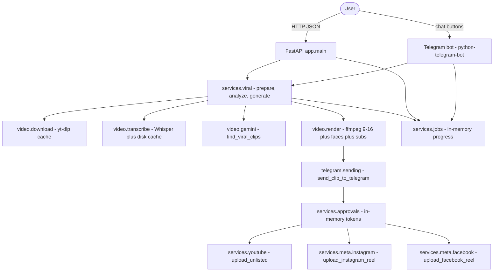
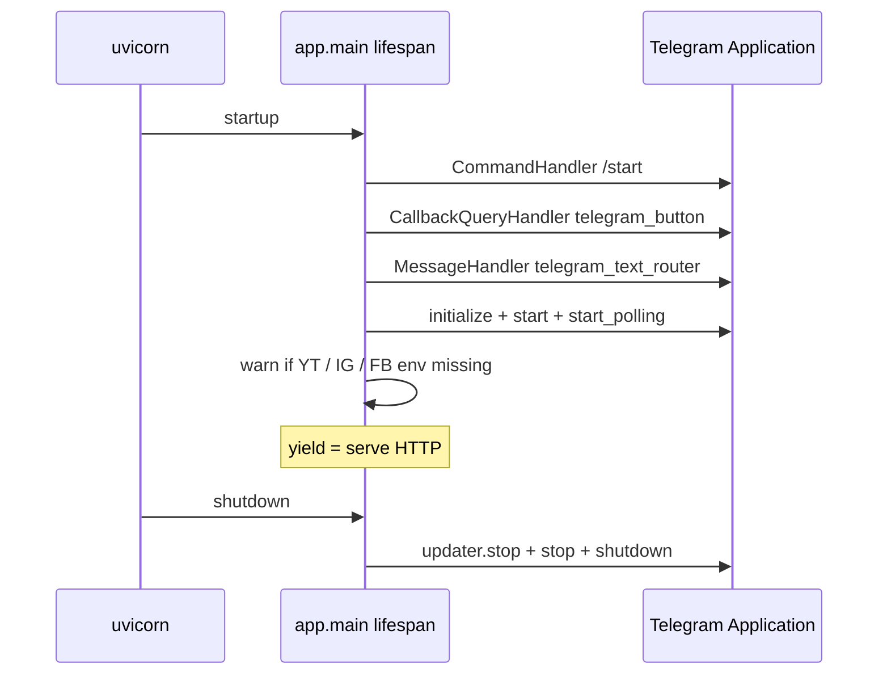
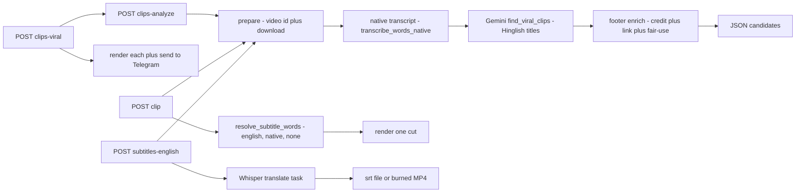
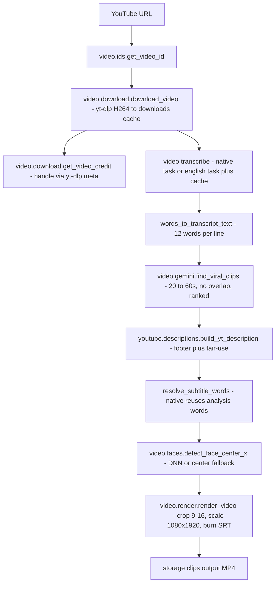
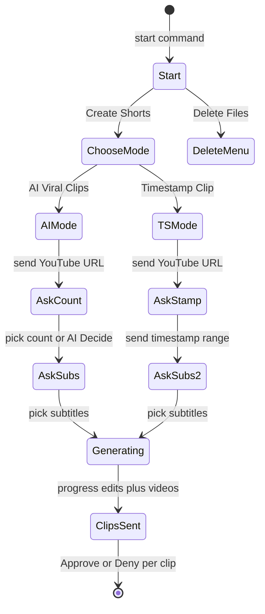
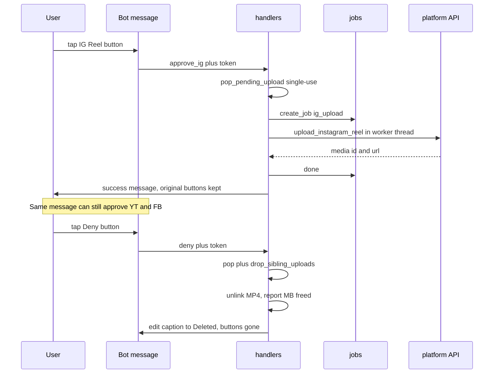
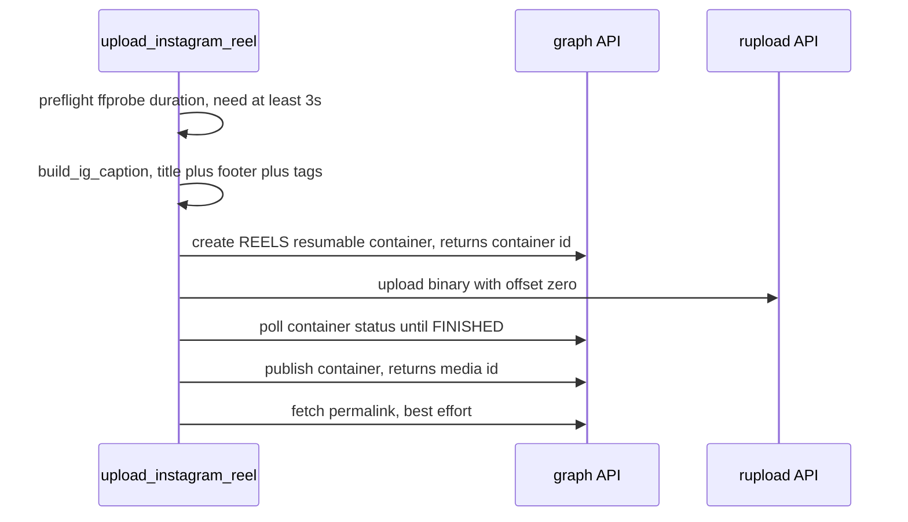
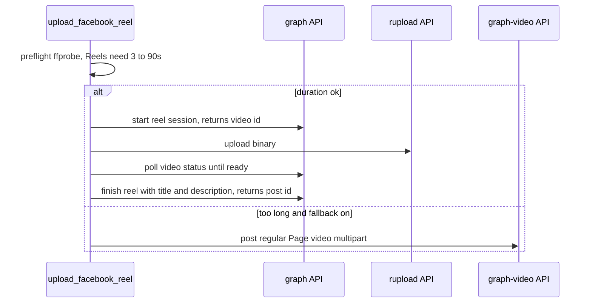

# AutoClips — Full App Flow

One document for how everything in this repo works end-to-end:
API → video pipeline → Telegram bot → uploads → storage/ops.

> Start here if you are new. For click-by-click credentials setup see
> [YOUTUBE_SETUP.md](YOUTUBE_SETUP.md) and [META_SETUP.md](META_SETUP.md).
> For API usage examples see [../README.md](../README.md).

---

## 1. What this app is

FastAPI server (`uvicorn app.main:app`) + Telegram bot running in the **same process**:

- **4 HTTP routes**: `POST /subtitles/english`, `POST /clip`, `POST /clips/analyze`, `POST /clips/viral` (+ `GET /health`, `GET /jobs/{id}`, `POST /admin/cleanup`).
- **Telegram bot**: `/start` → Create Shorts (AI Viral or Timestamp) → renders 9:16 clips → sends each MP4 with **✅ YouTube / 📸 IG Reel / 📘 FB Reel / ❌ Deny** buttons.
- **Uploads**: YouTube (Unlisted via OAuth), Instagram Reels + Facebook Page Reels (via Meta Graph API Page token).
- **AI**: Whisper (`faster-whisper`, local) for transcription + Gemini (`gemini-3.5-flash`) for viral-moment detection with Hinglish titles.

---

## 2. Architecture at a glance



**Key files:**

| Layer | Files |
|---|---|
| Entry | `app/main.py` (lifespan, middleware, routers), `app/config.py` (Settings + `storage/` paths), `app/logging_config.py` (request-id logs) |
| API | `app/api/schemas.py`, `deps.py` (slowapi limiter), `routes_health.py`, `routes_subtitles.py`, `routes_clip.py`, `routes_analyze.py`, `routes_viral.py` |
| Core pipeline | `app/services/viral.py`, `app/services/video/{ids,download,transcribe,gemini,subtitles,faces,render,process,timeutils,cleanup,paths}.py` |
| Uploads | `app/services/youtube/{uploads,descriptions}.py`, `app/services/meta/{captions,tokens,media,instagram,facebook}.py` |
| State | `app/services/jobs.py`, `app/services/approvals.py` |
| Telegram | `app/telegram/{bot,auth,handlers_start,handlers_buttons,handlers_generate,handlers_approve,handlers_approve_meta,sending,progress,cleanup_files}.py` |
| Scripts/docs | `scripts/get_youtube_token.py`, `scripts/get_meta_token.py`, `scripts/send_telegram_test.py`, `docs/YOUTUBE_SETUP.md`, `docs/META_SETUP.md` |

---

## 3. Boot sequence



Details (`app/main.py`):

- `load_dotenv()` then `setup_logging()`; every HTTP request gets an 8-char `req=*` id (also `X-Request-ID` header) so `grep req=abcd1234 storage/logs/app.log` follows one request.
- Polling: `poll_interval=2.0`, `timeout=30` (below `read_timeout=65s`), `bootstrap_retries=-1`, transient `NetworkError/TimedOut` downgraded to warning in `telegram/bot.py:_polling_error_callback`.
- Missing creds only warn at boot; the first Approve tap is what actually fails (with a setup hint).

---

## 4. Config (.env)

All code reads `app/config.py:settings` (pydantic-settings, `.env` file). Never `os.getenv` directly.

| Var | Needed for | Notes |
|---|---|---|
| `TELEGRAM_BOT_TOKEN`, `TELEGRAM_CHAT_ID` | bot (required) | `TELEGRAM_ALLOWED_CHAT_IDS` optional allowlist; private bot rejects others with `⛔ Unauthorized` (`telegram/auth.py`) |
| `GEMINI_API_KEY` | `/clips/analyze`, `/clips/viral`, Telegram AI mode | other routes work without it |
| `WHISPER_MODEL_SIZE/DEVICE/COMPUTE_TYPE` | transcription | defaults `small / cpu / int8` (better Hindi/Hinglish than `base`) |
| `FFMPEG_PRESET`, `LOG_LEVEL`, `YOUTUBE_COOKIES_FILE` | render/logs/bot-guard videos | `DEBUG` logs every ffmpeg/yt-dlp command |
| `YT_CLIENT_ID/SECRET/REFRESH_TOKEN`, `YT_CATEGORY_ID` | YouTube Approve | helper `scripts/get_youtube_token.py`; default category `22` |
| `META_APP_ID/SECRET`, `META_PAGE_TOKEN`, `FB_PAGE_ID`, `IG_USER_ID` | IG/FB Approve | helper `scripts/get_meta_token.py`; token ~60 days; buttons hidden until set |
| `META_API_VERSION` | Meta API | default `v26.0` |
| `META_IG_SHARE_TO_FEED` | IG Reels | default `true` (feed + Reels tab) |
| `META_FB_FALLBACK_TO_VIDEO` | FB >90s clips | default `true` → regular Page video post instead of error |
| `FACE_CONF_THRESHOLD`, `FACE_DETECT_SAMPLES`, `SKIP_FACE_DETECT` | 9:16 crop | OpenCV DNN (`assets/face_detector/`); `SKIP_FACE_DETECT=1` = center crop |

`GET /health` reports `ffmpeg/ffprobe`, `gemini_key_set`, `disk_free_mb`, `whisper_model`, plus `youtube/instagram/facebook_configured` (booleans only, no secrets).

---

## 5. The 4 HTTP routes

| Route | Input (`api/schemas.py`) | What it does | Returns |
|---|---|---|---|
| `POST /subtitles/english` (20/min) | `url, burn_in=false, vertical_crop=false` | `prepare()` → `transcribe_words_english()` → `.srt` via `write_srt()` **or** full-length MP4 via `render_video()` | `FileResponse` `.srt` / `.mp4` |
| `POST /clip` (20/min) | `url, start, end, vertical_crop=true, subtitles=none` | `prepare()` → `resolve_subtitle_words()` → `render_video(cut)` | `FileResponse` `.mp4` |
| `POST /clips/analyze` (10/min) | `url, max_clips=null` | `prepare()` → `analyze_viral_clips()` (native transcript → Gemini → footer enrich) → validate timestamps | JSON list `ViralClipInfo(title/start/end/duration_seconds/score/reason/hashtags/description)` |
| `POST /clips/viral` (5/min) | `url, max_clips=null, vertical_crop=true, subtitles=english` | `generate_viral_clips()` = analyze + render **every** candidate + `send_clip_to_telegram()` each | `{success, clips_sent, clips[{clip_id/file/title/score/.../sent}]}` |

Plus ops: `GET /jobs/{job_id}` (Telegram job progress), `POST /admin/cleanup?max_age_hours=72` (10/min).



Blocking `def` routes are intentional: FastAPI runs them in a threadpool (yt-dlp/Whisper/ffmpeg/Gemini all block). Only `/clips/viral` is `async`, and it pushes heavy work into `asyncio.to_thread` so Telegram polling stays responsive.

---

## 6. Video pipeline (shared by API + Telegram)



Notes / design choices (see README):

- Download + transcript caches mean repeat calls on the same `video_id` reuse work.
- `native` subtitles reuse the exact words used for detection → boundaries line up; `english` is a separate Whisper translate pass.
- Gemini count is open-ended (1–10+); `max_clips` only caps. Bad timestamps / `end<=start` are skipped with a warning, never fail the batch.
- Long videos are slow (download + transcribe + N×ffmpeg, synchronously in-request). Telegram jobs expose progress; next scale step would be Celery/RQ instead of in-memory `jobs`.

---

## 7. Telegram bot flow

### 7.1 Conversation state (`handlers_start.py` + `handlers_buttons.py`)



- URL accepted only **after** a mode is picked (else re-prompts with menu).
- Timestamp parsed by `parse_timestamp_range()` (`" - "` or `"-"`, `end > start` else error + example).
- `context.user_data` holds `mode / youtube_url / max_clips / timestamp / subtitles`; `cancel` clears it.
- Private bot: `auth.reject_if_unauthorized()` checks `TELEGRAM_CHAT_ID` + allowlist.

### 7.2 Generation (`handlers_generate.py` → `services/viral.py`)

- **AI**: `create_job("ai_viral")` → status message + `progress.run_progress_editor()` (edits same message every 15s, throttled) → `generate_viral_clips(req, job_id)` → done/failed edit. Stages: `downloading → transcribing → analyzing → rendering i/N → sending i/N` (`jobs` gets `percent/total_clips/done_clips`).
- **Timestamp**: `create_job("timestamp")` → `prepare()` → `resolve_subtitle_words()` → `render_video(vertical_crop=True)` → `send_clip_to_telegram()` → done.
- Heavy calls wrapped in `asyncio.to_thread`; a failed send never stops the remaining batch.

### 7.3 Sending (`telegram/sending.py`)

`send_clip_to_telegram(path, clip_id, title, score, reason, hashtags, description, source_video_id, credit)`:

1. >50 MB → skip video, send "too large, file kept" notice (Bot API cap), no buttons.
2. Caption: `🎬 New Short / 🆔 / 🔥 score / 🎯 title / #tags(≤6) / 📄 desc / 💡 reason`; >1024 chars → truncated + full pack as follow-up message.
3. Registers **one token per configured platform** (`approvals.register_pending_upload(..., platform=...)`): always YouTube, + IG if `META_PAGE_TOKEN+IG_USER_ID`, + FB if `META_PAGE_TOKEN+FB_PAGE_ID`. Keyboard:
   - row 1: `✅ YouTube (Unlisted)` → `approve:{tok}`
   - row 2 (if any): `📸 IG Reel` → `approve_ig:{tok}`, `📘 FB Reel` → `approve_fb:{tok}`
   - row 3: `❌ Deny (delete)` → `deny:{first_tok}`
4. `send_video()` with retries (3×: `RetryAfter` wait, `TimedOut` +5s). On total failure: pop all tokens + "file kept at clips/…" message.

### 7.4 Approve / Deny



| Handler | Job kind | API call | On success | On failure |
|---|---|---|---|---|
| `handlers_approve.handle_approve` (`approve:`) | `yt_upload` | `youtube.uploads.upload_unlisted(path, title, desc, tags, credit…)` | new `✅ YouTube Unlisted + youtu.be` message | keep file, new `✅ Retry upload` + Deny buttons |
| `handlers_approve_meta.handle_approve_ig` (`approve_ig:`) | `ig_upload` | `meta.instagram.upload_instagram_reel(...)` | new `✅ Instagram Reel published` message | keep file, `📸 Retry IG upload` |
| `handlers_approve_meta.handle_approve_fb` (`approve_fb:`) | `fb_upload` | `meta.facebook.upload_facebook_reel(...)` | new `✅ Facebook reel/video published` (+fallback note) | keep file, `📘 Retry FB upload` |
| `handlers_approve.handle_deny` (`deny:`) | — | `unlink` MP4 | edit caption to `🗑️ Deleted / Freed X MB` | error message |

Deny also calls `drop_sibling_uploads(path)` so the other platforms' buttons on the same clip resolve to `Already processed` instead of `FileNotFound`.

---

## 8. Upload integrations

### YouTube (`services/youtube/`)

- Auth: OAuth Desktop credentials (`YT_CLIENT_ID/SECRET/REFRESH_TOKEN`), scope `youtube.upload`. Service-account keys **cannot** upload.
- `build_upload_body()`: title ≤100, tags cleaned (strip `#`/spaces, ≤~480 chars total), description = `build_yt_description()` (AI desc + `Credit :- @x` + `Original video link:- …` + §107 disclaimer, idempotent) + `#tags`, ≤5000.
- `upload_unlisted()`: resumable `videos().insert(snippet,status)` with `privacyStatus=unlisted`, `madeForKids=false`. Errors mapped: `quotaExceeded` (~1600 units/upload ≈ 6/day) and `invalid_grant` (re-run helper).
- Quota/status in README + `YOUTUBE_SETUP.md`.

### Instagram (`services/meta/instagram.py` + `captions.py` + `tokens.py` + `media.py`)



- Resumable binary upload → **no public URL needed** for clips.
- Needs IG Professional linked to Page; token perms `instagram_basic + instagram_content_publish + pages_*`. Errors map 190/200 (re-run `get_meta_token.py`), perms, rate limits (~25/day).

### Facebook (`services/meta/facebook.py`)



- Limit ~30 Reels/24h; spec errors (`1363128` duration, `1363xx` resolution/fps) mapped to actionable messages. Clips are already 1080×1920 H.264 from the renderer, which is the recommended spec.

---

## 9. Storage, caching, background state

```
storage/            # gitignored, created by config.py
  downloads/ID.mp4  # yt-dlp cache, keyed by video_id, reused forever
  clips/ID-*.mp4    # rendered outputs (viral/timestamp/clip/english)
  tmp/              # whisper words cache ID-lang-task-words.json,
                    # credit cache ID.credit.txt, per-render .srt (auto-deleted)
  videos/           # reserved
  logs/app.log      # rotating 10 MB × 5
```

- `services/jobs.py`: `jobs[job_id] = {kind(ai_viral/timestamp/yt_upload/ig_upload/fb_upload), status, stage, percent, total_clips/done_clips, result/error, timestamps}`. Polled via `GET /jobs/{id}` and Telegram progress editor.
- `services/approvals.py`: `pending_uploads[token8] = {path, clip_id, title, description, hashtags, chat_id, source_video_id, credit, platform}`. In-memory → bot restart expires approvals (tap → "expired, file untouched"). Deny purges siblings.
- `POST /admin/cleanup?max_age_hours=72` (`video/cleanup.py:cleanup_old_files`) wipes old `downloads/clips/tmp/videos`; Telegram Delete-All (`cleanup_files.delete_all_files`) wipes all saved files but keeps folders.

---

## 10. Ops surface

| Item | Where | Notes |
|---|---|---|
| Rate limits | `api/deps.py` + per-route decorators | default 120/min; `/clip`+`/subtitles` 20/min, `/analyze` 10/min, `/viral` 5/min, `/admin/cleanup` 10/min → `429 {"detail": "Rate limit exceeded"}` |
| Logs | stdout + `storage/logs/app.log` | `LOG_LEVEL`; `req=` id on every line; ffmpeg/yt-dlp commands only at DEBUG; tokens masked (`tok…last4`) / never logged |
| Tests | `tests/unit/` + `conftest.py` | `pytest tests/ -q`; covers approvals, sending (incl. 3-button + token-drop), YT body, Meta captions/clients (mocked `requests`), render-faces, gemini parsing |
| Scripts | `scripts/` | `get_youtube_token.py` (OAuth browser flow), `get_meta_token.py` (Explorer token → long-lived Page token + IDs), `send_telegram_test.py` (connectivity check) |

---

## 11. Common tasks

| I want to… | Do this |
|---|---|
| Run locally | `pip install -r requirements.txt` (+ `ffmpeg`), `cp .env.example .env`, fill Telegram (+ Gemini for AI), `uvicorn app.main:app --reload --port 8000` → http://localhost:8000/docs |
| Preview AI picks without rendering | `POST /clips/analyze` → review JSON → `POST /clip` for winners (or `/clips/viral` for all) |
| Publish everywhere from Telegram | tap ✅ → 📸 → 📘 on the **same** clip message (order free); each has own retry |
| Clip too long for FB Reels | keep `META_FB_FALLBACK_TO_VIDEO=true` (posts as regular video with note) or cut ≤90s |
| Token expired | YT `invalid_grant` → re-run `get_youtube_token.py`; Meta 190/200 → re-run `get_meta_token.py` (~60d lifetime) |
| Disk full | Telegram 🗑️ Delete Files, or `POST /admin/cleanup?max_age_hours=24`; Deny per clip |
| Debug one request | `grep req=<X-Request-ID> storage/logs/app.log` |

---

## 12. Limits cheat-sheet

- Telegram video send ≤50 MB; caption ≤1024 (overflow sent as follow-up).
- YouTube: Unlisted, ~1600 quota units ≈ 6/day on default 10k quota.
- Instagram: caption ≤2200, ≤30 hashtags, Reel ≥3s (~25 API posts/day).
- Facebook: Reel 3–90s, 540×960 min (1080×1920 rec.), 24–60fps, ~30/24h; longer → regular video fallback (if enabled).
- Whisper default `small` (slower than `base`, better Hinglish); set `SKIP_FACE_DETECT=1` for faster center-crop renders.
